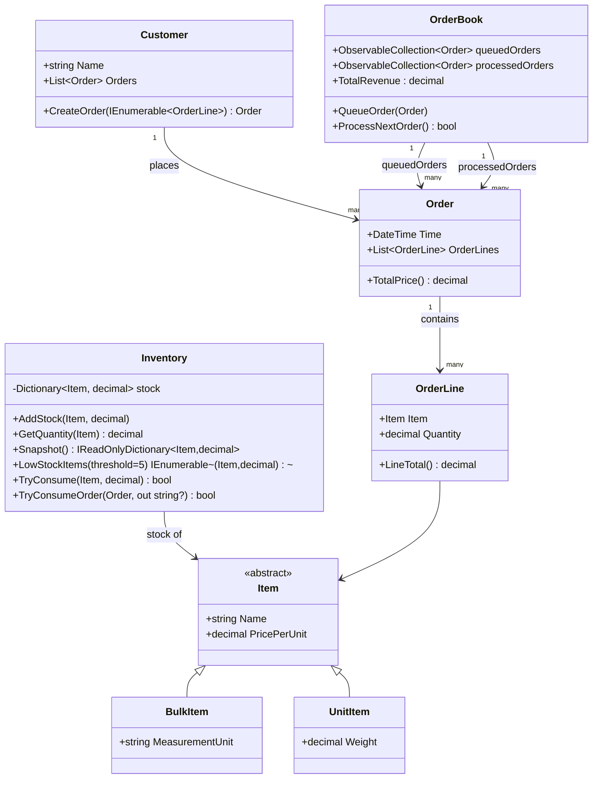

# Inventory System (WPF, .NET 8)

Implements the activity **Inventory system** with an object-oriented model and a WPF GUI using **DataGrid** for queued and processed orders.

## Build & Run
- Requires .NET 8 SDK and Windows (WPF).
- Open `InventorySystemWpf.sln` in Visual Studio (2022+) or run:
  ```
  dotnet build
  dotnet run
  ```

## Features
- Queued and processed orders (two `DataGrid`s)
- **Process Next** button moves the earliest queued order to processed, updates **Inventory** stock and **Total Revenue**
- Shows low stock items (threshold: 5)
- Model classes match the assignment spec

## Class Diagram (Mermaid)
> You can render this in VS Code's Mermaid Markdown preview, GitHub, or https://mermaid.live



## Screencast (<= 10s)
I cannot record your screen from here, but include a short screencast in this folder named `screencast.mp4`:
1. Run the app.
2. Click **Process Next →** at least once; show revenue increasing and low-stock badges updating.
3. Keep it under 10 seconds.
4. Save as `screencast.mp4` in the repo root.

### Quick capture options
- **Windows 10/11**: Press `Win`+`Alt`+`R` (Xbox Game Bar) to start/stop a short recording.
- **OBS**: Set Output→Recording Quality to Small; record ~7–9 seconds.

## Notes
- For simplicity, all stock quantities are stored as `decimal`. For `UnitItem` the quantity represents counts; for `BulkItem` it represents the measurement (e.g., kg).
- If an order exceeds available stock, processing is blocked with a message.
- `TotalRevenue` is computed from processed orders.